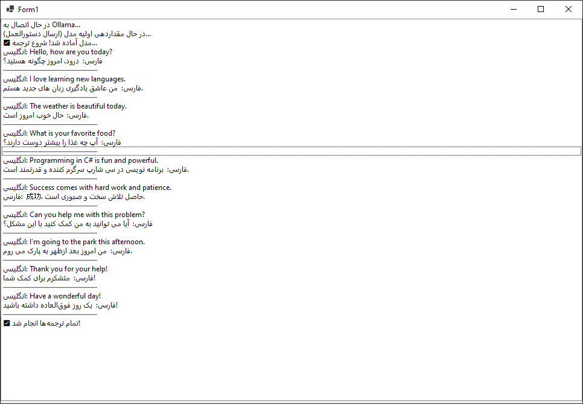
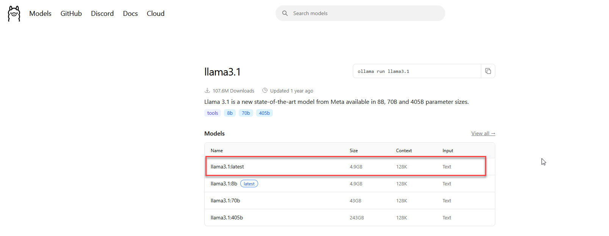
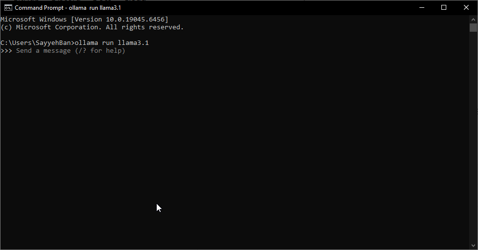

# Connect AI Ollama - ترجمه هوشمند با مدل‌های محلی Ollama در ویندوز فرم (.NET 10)

یک پروژه ساده و قدرتمند **Windows Forms** نوشته شده با **C# و .NET 10** که امکان ترجمه متون انگلیسی به فارسی (یا هر زبان دیگری) را با استفاده از مدل‌های هوش مصنوعی محلی **Ollama** (مثل Llama 3.1) فراهم می‌کند.

هدف این پروژه:  
استفاده آسان از مدل‌های بزرگ زبانی روی کامپیوتر شخصی بدون نیاز به اینترنت یا APIهای ابری، با یک رابط گرافیکی زیبا و روان.



## ✨ ویژگی‌ها

- اتصال مستقیم به سرور محلی **Ollama**
- استفاده از کلاس قابل استفاده مجدد `LocalAiTranslator` (قابل انتشار در NuGet)
- ترجمه دقیق و سریع متون با حفظ قالب و علائم نگارشی
- رابط کاربری ساده با **ListBox** برای نمایش لحظه‌ای نتایج
- پشتیبانی کامل از **async/await** برای جلوگیری از فریز شدن UI
- نوشته شده با **.NET 10 رسمی** و **Visual Studio 2026**

## 🚀 پیش‌نیازها

1. **نصب Ollama**  
   دانلود و نصب از سایت رسمی:  
   👉 [https://ollama.com/download](https://ollama.com/download)

   

2. **دانلود مدل Llama 3.1**  
   به صفحه مدل بروید:  
   👉 [https://ollama.com/library/llama3.1](https://ollama.com/library/llama3.1)

   

3. **اجرای مدل در ترمینال (CMD یا PowerShell)**

   ```bash
   ollama run llama3.1
   ```

   این دستور مدل را دانلود و اجرا می‌کند (در اولین اجرا ممکن است چند دقیقه طول بکشد).

   

4. **محل ذخیره مدل‌ها در ویندوز**  
   پس از دانلود، فایل‌های مدل (حدود ۴-۵ گیگابایت) در مسیر زیر ذخیره می‌شوند:  
   ```
   C:\Users\نام_کاربری_شما\.ollama\models
   ```
   > نکته: پوشه `.ollama` مخفی است. در File Explorer گزینه **View → Show → Hidden items** را فعال کنید تا ببینید.

5. **نصب پکیج NuGet (اختیاری اما توصیه‌شده)**  
   کلاس اصلی ارتباط با Ollama در پکیج شخصی من قرار دارد:  
   👉 [SayehBanTools on NuGet](https://www.nuget.org/packages/SayehBanTools)

   همچنین پکیج مورد نیاز:
   ```
   Install-Package OllamaSharp
   ```

## 🛠 نحوه استفاده

1. پروژه را کلون کنید یا دانلود کنید.
2. Ollama را اجرا کنید و مدل `llama3.1` را با دستور بالا فعال نگه دارید.
3. پروژه را در **Visual Studio 2026** باز کنید.
4. اجرا کنید (F5) → فرم به طور خودکار به Ollama متصل می‌شود و ترجمه جملات نمونه را نمایش می‌دهد.

## 📦 ساختار پروژه

- `Form1.cs` → رابط کاربری و منطق اصلی
- `AI/Ollama/LocalAiTranslator.cs` → کلاس هوشمند و قابل استفاده مجدد برای ارتباط با Ollama
- `Image/` → تصاویر راهنما

## 💡 گسترش پروژه

این پروژه پایه‌ای عالی برای:
- ترجمه فایل‌های متنی بزرگ
- تولید زیرنویس فیلم
- ساخت چت‌بات محلی
- ابزارهای توسعه نرم‌افزار با هوش مصنوعی آفلاین

است. فقط کافیه لیست متون رو تغییر بدی یا ورودی TextBox و دکمه اضافه کنی!

## 👨‍💻 توسعه‌دهنده

ساخته شده با ❤️ توسط **SayehBan**  
پکیج‌های مرتبط: [SayehBanTools](https://www.nuget.org/packages/SayehBanTools)

---

**Star بده اگر خوشت اومد!** ⭐  
هر پیشنهادی داری، Issue باز کن یا Pull Request بفرست 😊

#ConnectWithAI #Ollama #CSharp #DotNet10 #LocalAI #OfflineTranslation
